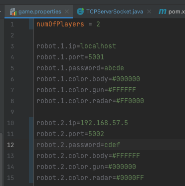
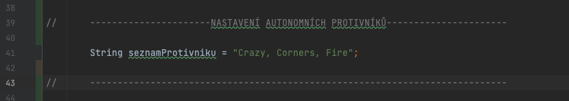
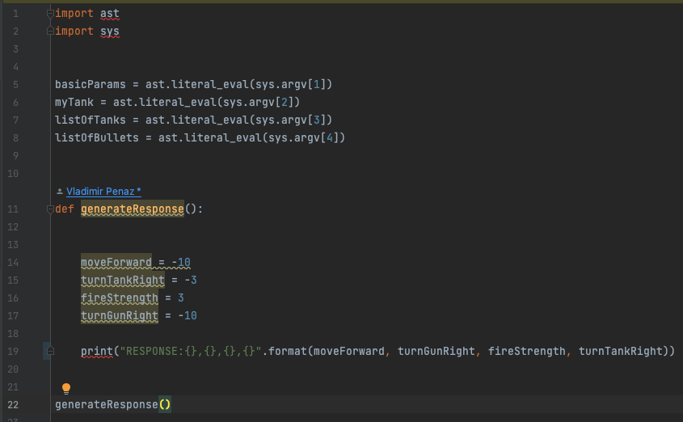
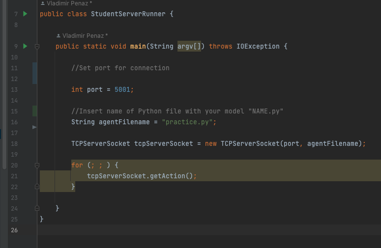
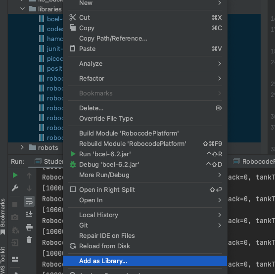
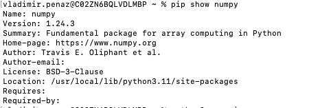

Repozitář projektu na GitLab: https://code.utko.feec.vutbr.cz/burgetrm/robocodeplatform.git

# Platforma Robocode návod:

Tento stručný návod by měl uživatele seznámit s ovládáním platformy.

## Nastavení prostředí:

### Parametry tanku:

Ve složce `RoboCode/config/` se nachází soubor `game.properties` ve kterém je nezbytné nastavit předpokládaný
počet vzdáleně připojených tanků a následně nastavit inrormace o každém z nich. V konfiguračním souboru jsou
definovány ip adresy, porty, hesla a barva tanků viz. příklad pro 2 tanky. V případě lokálního testování lze
místo ip adresy zadat `localhost`

### Nastavení autonomních protivníků:

Do hry je možné zapojit i předdefinované autonomní roboty, kteří jsou součástí platformy. Tyto tanky jsou vhodné
pro učení nebo testování vlastního modelu. Jejich zapojení do hry se nastavuje ve třídě
`src/cz/vutbr/feec/robocode/battle/RobocodeRunner.java` kde se nachází atribut typu `String` s názvem
`pocetProtivniku`. Zde je možné vybírat všechny tanky ze složky `src/sample` mimo tanku `RobotClient`.

### Komunikace s modelem:

Model je pravidelně spouštěn na serveru a pro předání instrukcí je využíván výpis v požadovaném formátu
`RESPONSE:10000,-120,1,-30` pouze takto zapsané instrukce dokáže server zpracovat. **Je třeba aby byl výstup
vypsán na konzoli například skrze příkaz `print()`, pokud by se použilo `return` k předání instrukcí nedojde.
** Přijímané parametry jsou zpracovány pomocí příkazu `ast.literal_eval(sys.argv[1])` na seznam. V ukázkovém
příkladu `parctice.py` je ukázán příklad možného vstupu, jeho zpracování a formátování výstupu.

### Spuštění serveru:

Pro spuštění serveru byla vytvořena třída `StudentServerRunner.java` ve složce `src/cz/vutbr/feec/robocode/battle`.
V této třídě je nutné před spuštěním nadefinovat port na kterém je očekáváno spojení (stejný jako v `game.properties`),
dále musí uživatel nastavit atribut `agentFilename` kam zadá název svého natrénovaného modelu. Tento model musí být
uložen v adresáři `RoboCode/src/cz/vutbr/feec/robocode/studentRobot`, jinak nebude spuštěn. Jméno souboru se zadává
včetně koncovky tedy ve formátu `NAME.py` a musí být implementován v jazyce python. Pro případ potřeby otestování více
modelů zároveň lokálně byla vytvořena třída `ServerRunnerTestSecond.java` s totožnými vlastnostmi. Je zde tedy možnost
spustit dva servery s rúznými modely zároveň na lokální adrese.

### Spuštění hry:

Hra začíná spuštěním třídy `RobocodeRunner`. Pouze je nezbytné prvně spustit servery a až poté spustit tuto třídu.

## Možné problémy:

### Instalace knihoven:

Projekt by si měl automaticky stáhnout požadované knihovny pomocí nástroje Maven, může se ale stát, že se tento build
nepodaří. Pro tyto případy je součástí repozitáře složka `libraries` se všemi požadovanými knihovnami. V případě potřeby
stačí pouze přidat knihovny ve vašem prostředí viz. obrázek.

### Nekomunikující model:

Může se stát, že nebude odpovídat natrénovaný model v Pythonu. Prvním problémem by mohl být nevhodný formát výstupu,
který je přesně definován. Tehdy je vhodné využít tento vzor pro výpis

`print("RESPONSE:{},{},{},{}".format(moveForward, turnGunRight, fireStrength, turnTankRight))`

Druhým problémem, který by se mohl objevit je to, že nemáte nainstalovaný python v počítači případně nemáte
nainstalovanou
některou z používaných knihoven. Může se stát, že vaše IDE má vlastní základní verzi Pythonu, se kterou a váš skript při
spuštění v IDE funguje, ale pokus je spuštěn na počítači mimo něj, například z příkazové řádky tak nemá nainstalovaný
Python, který by skript spustil. Proto radši zkontrolujte v cmd zda máte v počítači nainstalovaný python ve verzi
3 `python –version` případně všechny knihovny které váš model využívá například `pip show numpy`.

